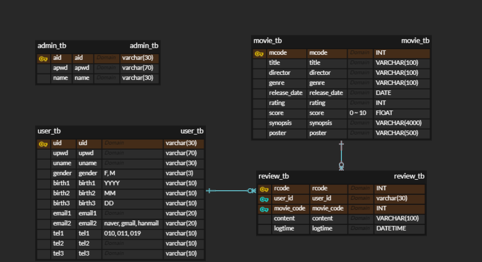

# FilmNote (영화 리뷰 사이트)


## Abstract ##
**FilmNote** 는 사용자가 영화를 조회하고 리뷰를 작성할 수 있는 영화 리뷰 플랫폼입니다. 이 시스템은 회원 서비스와 관리자 서비스를 통해 영화 등록 및 관리 기능을 제공합니다. 사용자는 회원 가입과 로그인을 통해 개인 정보를 관리하고, 다양한 영화를 조회하며 리뷰를 작성, 수정 및 삭제할 수 있습니다. 관리자는 영화 등록, 목록 조회, 상세 정보 확인 및 수정 기능을 통해 영화 데이터를 효과적으로 관리할 수 있습니다. 이 프로젝트는 사용자 친화적인 인터페이스와 효율적인 데이터 관리를 통해 영화에 대한 의견을 나누고 공유할 수 있는 환경을 제공합니다.


## 🛠️ 개발 환경

- **프로그래밍 언어**: HTML, CSS, JavaScript
- **IDE**: Eclipse (jdk-17)
- **DBMS**: MySQL Database
- **SQL 툴**: DBeaver
- **버전 관리**: GitHub
- **Naver Cloud DB**: filmnote-mysql
- **Naver Cloud Object Storage**: filmnote-bucket-116


## 📰 Database

- **admin_tb**: 관리자 정보 테이블
	

- **user_tb**: 회원 정보 테이블
	
	
- **movie_tb**:  영화 정보 테이블
	
	
- **review_tb**:  리뷰 정보 테이블
	
	
### ERD ###



## 🎰 주요 기능

### 회원 서비스

1. **회원 기능**
	- 회원 가입
	- 로그인
	- 회원정보 수정
	- 회원 탈퇴

2. **리뷰 기능**
  - 영화 조회
  - 영화 리뷰 조회
  - 영화 리뷰 작성
  - 영화 리뷰 수정
  - 영화 리뷰 삭제

### 관리자 서비스
1. **영화 관리 기능**
	- 영화 등록
	- 영화 목록 조회
	- 영화 상세 조회
	- 영화 수정
	- 영화 삭제


## 🗒️사용법
1. 사용자 가입 및 로그인:
	- 새로운 사용자는 사용자 이름, 아이디, 비밀번호, 성별, 생년월일, 이메일, 휴대전화를 입력하여 가입할 수 있습니다.
	- 가입된 사용자는 아이디와 비밀번호를 사용하여 로그인할 수 있습니다.

2. 영화 검색 및 선택:
	- 사용자는 관리자가 등록한 영화를 검색하고 영화의 정보를 확인할 수 있습니다.
	- 사용자 본인 및 다른 사용자가 작성한 리뷰를 확인할 수 있습니다.
	
3. 영화 리뷰 작성:
	- 사용자는 선택한 영화의 리뷰를 작성할 수 있습니다.
	- 본인이 등록한 리뷰를 수정 및 삭제할 수 있습니다.

  
## 🪪 팀 소개

```
박채연
E-mail : p3chaeyeon@gmail.com
```

```
김성찬
E-mail : sck2270@gmail.com
```

```
김태원
E-mail : dior911124@gmail.com
```

```
이유진
E-mail : ujin302@gmail.com
```

## **역할**

|          | 주요 작업                                                                                                    |
| -------- | ------------------------------------------------------------------------------------------------------------ |
|  박채연  | 클라우드 DB, Object Storage 생성, 관리자 영화 게시판 등록, 목록(관리자 메인 페이지), 조회, 수정, 삭제, 검색         |
|  김성찬  | 사용자 회원 가입, 로그인, 관리자 로그인, NCP 이미지 수정, 삭제                                                    |
|  김태원  | 사용자 회원정보 수정, 회원 탈퇴, 관리자 영화 게시판 검색                                                          |
|  이유진  | 전체 DB 설계, 영화 조회 (사용자 메인 페이지), 사용자 리뷰 작성, 조회, 수정, 삭제, 영화 데이터 수집(오픈 API 사용)    |


## 🤝 기여

본 프로젝트는 오픈 소스 프로젝트로, 기여를 원하시는 분은 [GitHub 리포지토리](https://github.com/your-repo)에서 문제를 보고하거나 Pull Request를 통해 기여해 주세요.

---

이 `README.md` 파일은 `FilmNote`의 구조와 기능을 이해하는 데 도움이 될 것입니다. 필요한 경우, 추가적인 정보와 자세한 설명을 포함하여 프로젝트의 문서를 보강할 수 있습니다.

